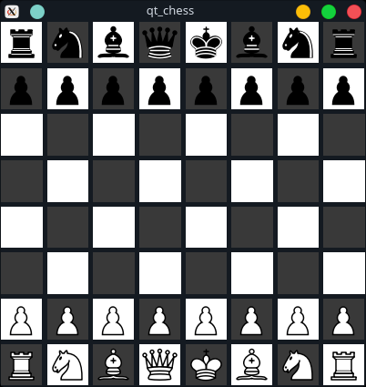
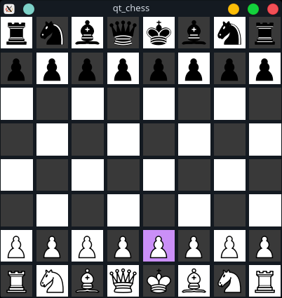
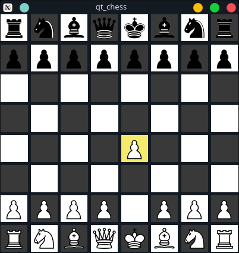
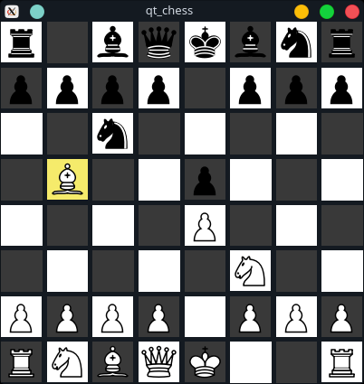

# Qt Chess

This is a project of the Object-Oriented Programming class. The goal was to create a
program using the concepts of objects and polymorphism learned during the semester in the C++ language.
I was free to choose the project, the only thing to consider was that the graphic part should be implement using the Qt Framework. 
I've choose to make a graphic chess board, hence the projects name: Qt chess.

# Graphics
Some examples of the game graphics
|Game|Select Piece|Move Piece|Game Development|
|----|------------|----------|----------------|
||||

# Resources

I ended up looking at some implementations of the chess design in the internet, the one that
helped me the most was an article intitled ____
by Yiran Zhong. And most of the foundation of this project were heavely based on the article.

The chess pieces were made by . And I draw the black and white squares on GIMP.

# Todo

There're some things to be implemented like:
- El Passan
- Castling
- Play against a chess engine

And improvements in the graphic design:
- Correct the spacing between squares
- Reset the match
- Enable layout and colors

# Build

## Requirements
- QT5
- Make
- GCC

## Steps
Download the project and inside the folder on terminal do:
```bash
make
./build/qt_chess
```
